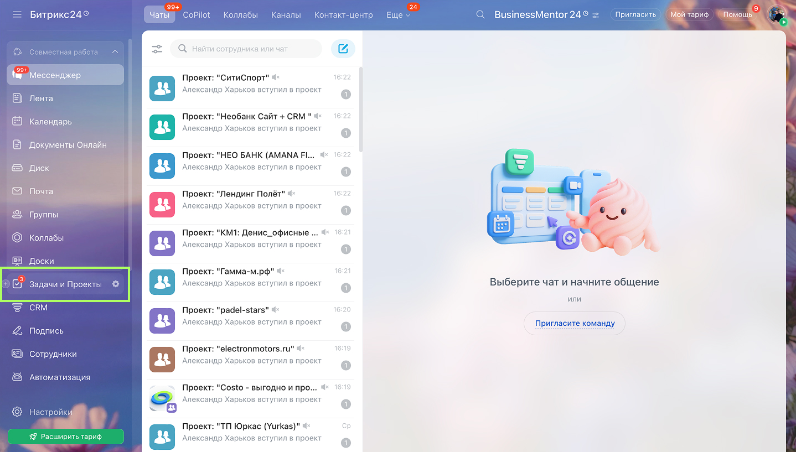
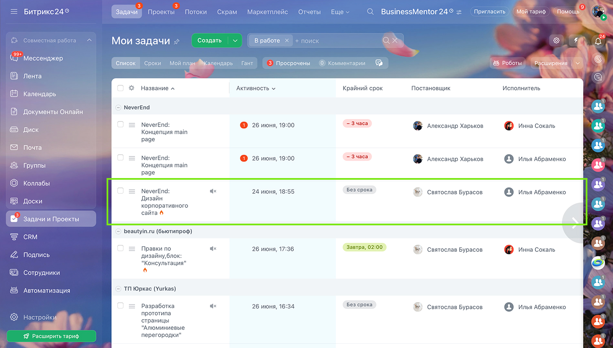
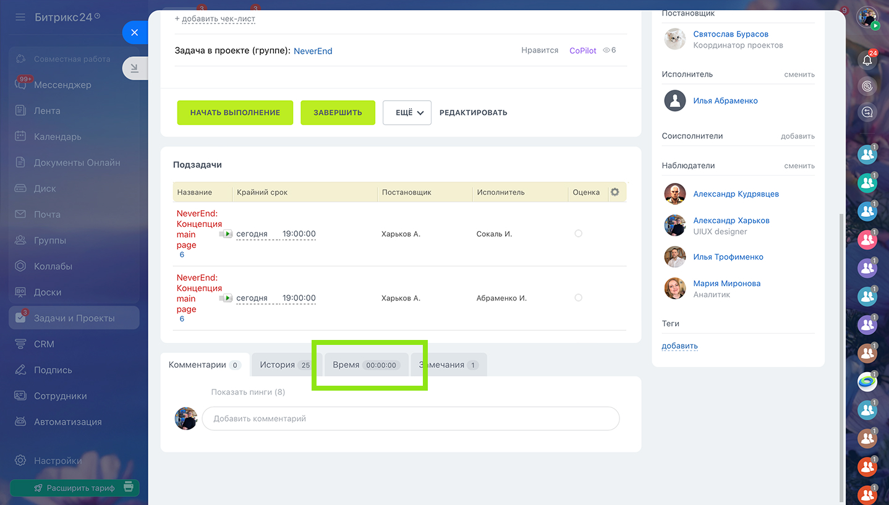
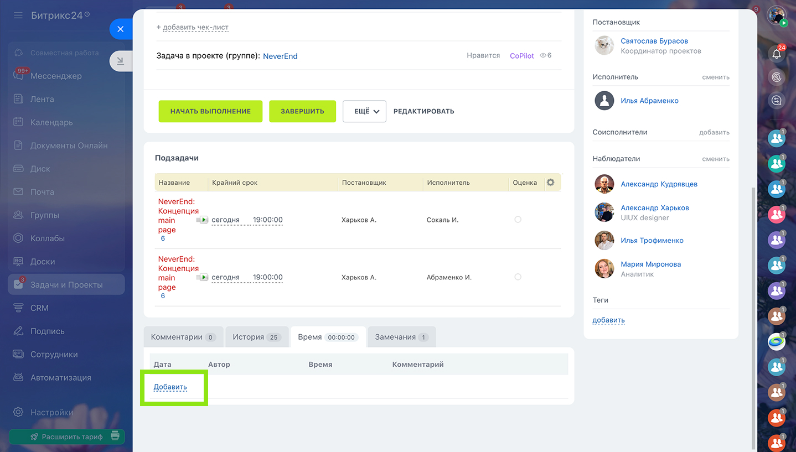
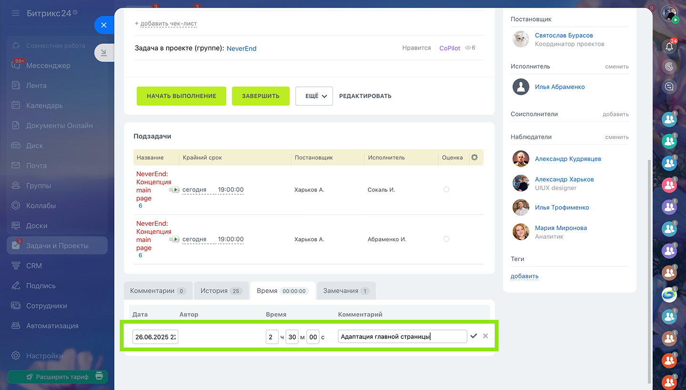
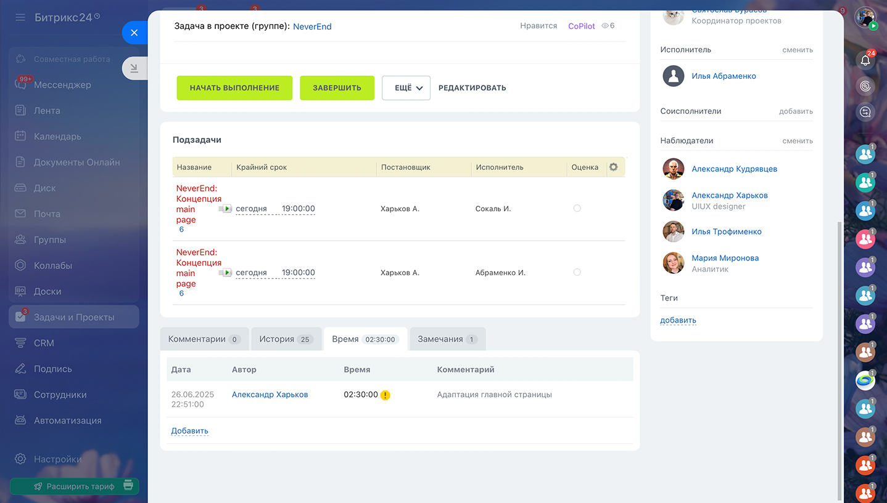

<note type="tip" title="Важные поинты" collapsed="true">

1. У каждого должно быть 8 часов по итогам дня, 40 по итогам недели;

2. Оптимально трекать задачи в конце рабочего дня;

3. Округляем время до получасов / часа (Не нужно трекать 1 ч 17м);

4. **В конце недели мной формируется краткий отчет о затраченных часах.**

</note>

## ✅  **Краткая инструкция**

1. В боковом меню переходим в «Задачи и проекты». В этом разделе доступны все ваши задачи. *Если задачу вам поставили через Telegram и в списке ее нет, то создаете сами или сообщаете* [*мне*](https://t.me/kharkovdesign) *об этом.*

2. Выбираете нужную задачу, над которой работаете и переходите в нее.

3. В открытом окне снизу переходите во вкладку «Время», нажимаете «Добавить».

4. Указываете дату, время потраченное на задачу. Также пишем краткий комментарий - что конкретно делали (дизайн главного экрана, адаптация, ui-kit и т.п). Кликаете на галочку.

5. [Короткое видео по треканию в Bitrix24.](https://www.loom.com/share/70f3c25d5c0341ff8ba82c8ea77b0943?sid=9ed4b1b7-0748-4150-b321-df0d7484831e)

## 🙋‍♂️ **Зачем мы трекаем?**

1. **Чтобы понимать реальную загрузку команды.** Нагрузка и задачи между всеми дизайнерами будут распределяться равномерно.

2. **Чтобы планировать время и сроки реалистично**. Сократим количество случаем, когда нужно финализировать задачу за 30 минут до дедлайна.

3. **Постоянный трекинг постепенно позволяет перейти к оценке задач (estimate)**. Это ключевой навык для продуктового дизайнера.

4. **И еще раз - это не про контроль.**

## 🙌🏻  **Подробная инструкция (с картинками!**)

1. Ищем в боковом меню вкладку «Задачи и проекты», открываем ее.

   {width=1438px height=817px}

2. Попадаем в список, поставленных вам задач. Ищем нужную, кликаем по ней.

   {width=1438px height=817px}

3. В модальном окне спускаемся в самый низ. Нам нужна вкладка «Время», кликаем по ней.

   {width=1438px height=817px}

4. Кликаем на «Добавить»

   {width=1438px height=817px}

5. В inputs указываем: дату выполнения, потраченное время и комментарий. В последнем указываем, чем занимались в этот трек: дизайн главного экрана, адаптация, ui-kit и т.п (Внесение правок, созваны с командой - тоже указываются).

   {width=1438px height=817px}

6. Поздравляю! Задача затрекана. Редактировать параметры можно по наведению на строку трека.

   {width=1438px height=817px}